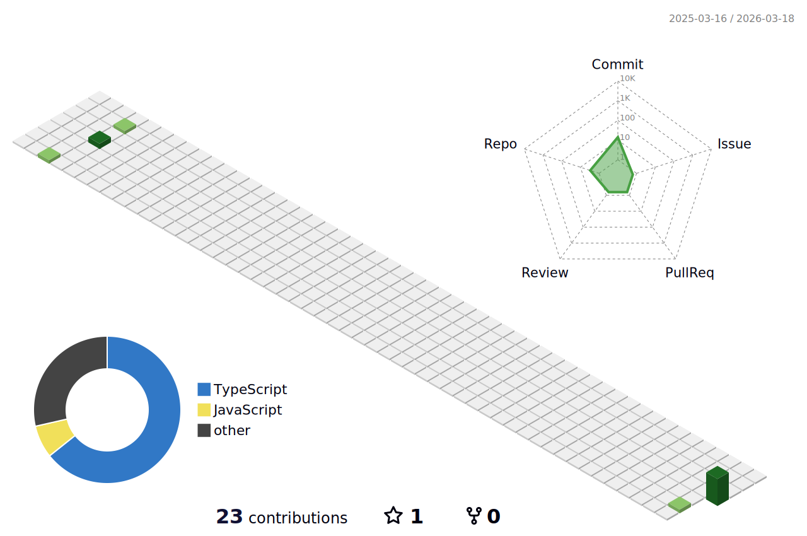

### Hey, I'm Shashank

Frontend developer who builds interactive web experiences. Currently exploring the intersection of 3D graphics and web development.

---

**What I'm working on**

- **3D Shoe Customization & Store** - Interactive 3D shoe customizer built with Three.js. Users design dream shoes by picking colors and materials for bands, laces, stripes, and insoles in real-time.
- **ImageGen** - AI image generation studio powered by OpenAI's gpt-image-1. Generate, edit (paint/crop/resize), and download images from text prompts.
- **AI Bill Splitter** - Upload a bill photo, and the app reads it to split costs evenly or however you choose across a group.

**What I'm learning**

WebGPU, React Server Components, and whatever new thing dropped in frontend this week.

---

**Tech Stack**

**Frontend**

**Backend & Data**

**Tools**

---

**3D Contribution Graph**

<picture>
  <source media="(prefers-color-scheme: dark)" srcset="./profile-3d-contrib/profile-night-green.svg" />
  <source media="(prefers-color-scheme: light)" srcset="./profile-3d-contrib/profile-green.svg" />
  
</picture>

---

**Connect**

