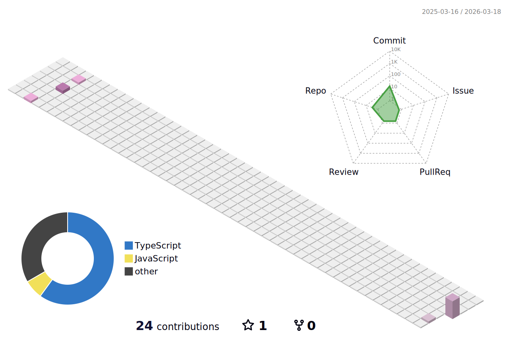

  
  

  

---

### What I'm building

<table>
<tr>
<td width="50%">

**3D Shoe Customizer**
Interactive 3D platform where users design dream shoes - pick colors & materials for every part, view in real-time, and purchase.
`Three.js` `React` `Tailwind`

</td>
<td width="50%">

**ImageGen**
AI image generation studio. Generate from text, then paint, crop, resize - all in-browser.
`Next.js` `OpenAI API` `Canvas API`

</td>
</tr>
<tr>
<td width="50%">

**AI Bill Splitter**
Snap a photo of any bill, auto-read line items, split costs however you want across a group.
`React` `AI/OCR` `MongoDB`

</td>
<td width="50%">

**& more coming...**
Currently exploring WebGPU, shaders, and whatever new thing dropped in frontend this week.

</td>
</tr>
</table>

---

### Tech Stack

  

---

### GitHub Stats

  
  

  

---

### Isometric Contributions

  

---

### Coding Habits

  

---

### 3D Contribution Skyline

<picture>
  <source media="(prefers-color-scheme: dark)" srcset="./profile-3d-contrib/profile-night-rainbow.svg" />
  <source media="(prefers-color-scheme: light)" srcset="./profile-3d-contrib/profile-season-animate.svg" />
  
</picture>

